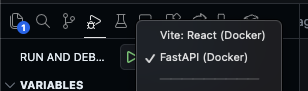
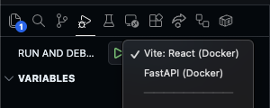

# eli25 (explain like i'm 25)


-   Hosted at https://eli25.vercel.app
-   Articles are pulled daily from [NewsAPI](https://newsapi.org/)
-   Summarized with hugging face model [sshleifer/distilbart-cnn-12-6](https://huggingface.co/sshleifer/distilbart-cnn-12-6)
-   Results are processed and saved to a Supabase database with Github actions and Docker

## Stack

-   Frontend

    -   [React](https://react.dev/learn)
    -   [TypeScript](typescriptlang.org/cheatsheets/)
    -   [@tanstack/router](https://tanstack.com/router/latest)
    -   [@tanstack/query](https://tanstack.com/query/latest)
    -   [tailwindcss](https://tailwindcss.com/)

-   Backend
    -   Services
        -   [x] Retrieve news articles from newsapi.org
    -   Supabase
        -   [x] articles table - Save articles and summaries to Postgres db
    -   Summaries
        -   [x] Parse article text with [trafilatura](https://trafilatura.readthedocs.io/en/latest/)
        -   [x] Summarize article text with hugging face model [sshleifer/distilbart-cnn-12-6](https://huggingface.co/sshleifer/distilbart-cnn-12-6)
    -   Automation
        -   [x] Run Docker compose or `process_daily_articles.py` script to process daily articles
        -   [x] Automate daily summaries with GitHub actions
    -   fastapi routes for:
        -   [x] `/news/` - Latest articles and summaries
        -   [x] `/news/YYYY-MM-DD` - Loading older articles and summaries (at least previous ones that were saved)
        -   [x] `/` - Static site

## Installation

Install the following

-   [Node Package Manager](https://www.npmjs.com/)
-   [Python package manager](https://pip.pypa.io/en/stable/)
-   [Docker Desktop](https://www.docker.com/)

Create an .env file in the root directory with the folllowing contents:

```properties
DEV=True
VITE_CLIENT_URL=https://localhost:3000
VITE_SERVER_URL=https://localhost:3300/api
PYTHONPATH=./src/server
GEMINI_API_KEY=YOUR_GEMINI_API_KEY
HF_TOKEN=YOUR_HF_TOKEN
NEWS_API_TOKEN=YOUR_NEWS_API_TOKEN
SUPABASE_URL=YOUR_SUPABASE_URL
SUPABASE_KEY=YOUR_SUPABASE_KEY
```

Run the following in the `eli25` directory

```bash
git clone https://github.com/mlmar/eli25
cd eli25

make install
```

## Development and Debugging in VSCode

In the `eli25` directory, run the following in the terminal:

```bash
make run
```

This will launch the Docker container for both the server and client.
All dependencies should be installed. Ignore frozen module warnings.

While development Docker container is running, navigate to the Run and Debug panel.

**Attach to the Python FastAPI server to run it.**



Attach to the React Vite server:



## Production

Set the following env properties

```properties
VITE_CLIENT_URL=https://PRODUCTION_URL.com
VITE_SERVER_URL=https://PRODUCTION_URL.com/api
```

Production

```bash
docker build .
```
